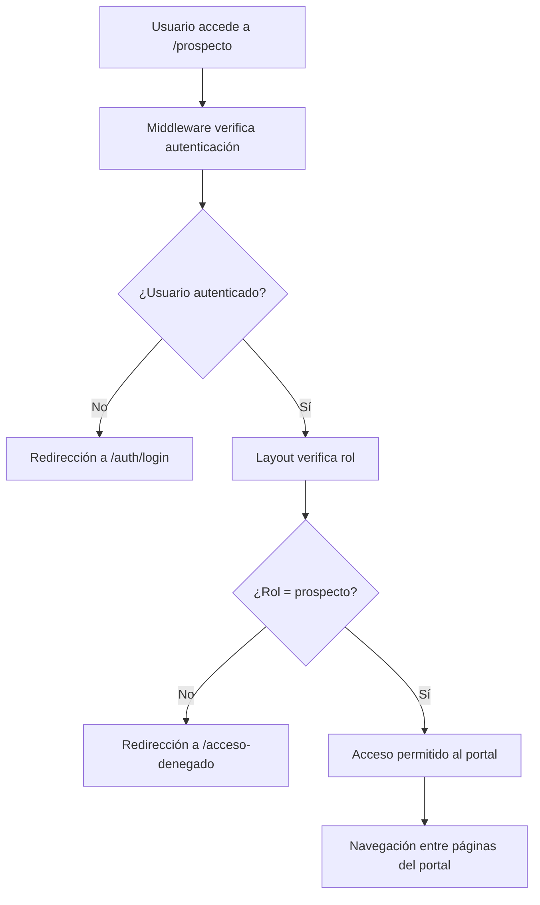

# Bloque 7 - Portal del Prospecto - Documentación Completa

## 1. Resumen del Bloque

El Bloque 7 implementa el portal completo para usuarios con rol "prospecto", proporcionando una experiencia segura y funcional que incluye autenticación, navegación, gestión de perfil y acceso a documentos públicos. Este bloque establece la base para la interacción de prospectos con la plataforma.

**Estado actual:** 95% completado - Falta integrar calendario (se implementará después del Bloque 8)

## 2. Arquitectura del Portal del Prospecto

### 2.1 Estructura de Archivos Implementados

```
src/
├── lib/supabase/
│   └── server.ts                    # Cliente Supabase para servidor
├── app/
│   ├── actions/
│   │   ├── documents.ts             # Server Actions para documentos
│   │   └── profile.ts               # Server Actions para perfil
│   └── prospecto/
│       ├── layout.tsx               # Layout con seguridad y navegación
│       ├── page.tsx                 # Redirección a bienvenida
│       ├── bienvenida/
│       │   └── page.tsx             # Página de bienvenida
│       ├── sala-de-datos/
│       │   └── page.tsx             # Acceso a documentos públicos
│       └── perfil/
│           └── page.tsx             # Gestión de perfil personal
```

### 2.2 Flujo de Seguridad



## 3. Implementaciones Detalladas

### 3.1 Tarea 7.1: Cliente Supabase para Servidor

**Archivo:** `src/lib/supabase/server.ts`

**Funcionalidades implementadas:**
- Cliente Supabase optimizado para Server Components
- Manejo seguro de cookies de autenticación
- Configuración para operaciones del lado del servidor
- Integración con Next.js App Router

**Características técnicas:**
- Utiliza `@supabase/ssr` para manejo de cookies
- Configuración específica para entorno de servidor
- Reutilizable en todos los Server Components

### 3.2 Tarea 7.2: Layout del Prospecto con Seguridad

**Archivo:** `src/app/prospecto/layout.tsx`

**Funcionalidades implementadas:**
- **Verificación de autenticación:** Redirección automática si no hay usuario
- **Verificación de rol:** Solo usuarios con rol "prospecto" pueden acceder
- **Navegación integrada:** Enlaces a todas las secciones del portal
- **Manejo de errores:** Redirecciones apropiadas para acceso denegado

**Navegación incluida:**
- Bienvenida (`/prospecto/bienvenida`)
- Sala de Datos (`/prospecto/sala-de-datos`)
- Mi Perfil (`/prospecto/perfil`)
- Cerrar Sesión (funcionalidad de logout)

### 3.3 Tarea 7.3: Página de Bienvenida

**Archivo:** `src/app/prospecto/bienvenida/page.tsx`

**Funcionalidades implementadas:**
- Mensaje de bienvenida personalizado
- Instrucciones claras para el usuario
- Pasos guiados para completar el perfil
- Integración con el sistema de navegación

**Contenido principal:**
1. **Paso 1:** Completa tu perfil y explora los documentos en la 'Sala de Datos'
2. **Paso 2:** Revisa la información de la propiedad
3. **Paso 3:** Agenda una cita con nuestro equipo (pendiente de calendario)

### 3.4 Tarea 7.4: Página Raíz de Redirección

**Archivo:** `src/app/prospecto/page.tsx`

**Funcionalidades implementadas:**
- Redirección automática de `/prospecto` a `/prospecto/bienvenida`
- Mejora la experiencia de navegación
- Evita páginas vacías o de error

### 3.5 Tarea 7.1.1: Sala de Datos

**Archivo:** `src/app/prospecto/sala-de-datos/page.tsx`

**Funcionalidades implementadas:**
- **Consulta de documentos públicos:** Obtiene documentos con `category = 'MARKETING'`
- **Tabla de documentos:** Muestra nombre y acción de descarga
- **Integración con Supabase:** Consulta directa a la tabla `documents`
- **Componente de descarga:** Botón cliente para descargas seguras

**Correcciones realizadas:**
- Cambio de columnas consultadas: `name` → `file_name`, `file_path` → `storage_path`
- Actualización de filtro: `is_public_prospectus = true` → `category = 'MARKETING'`
- Corrección de uso de `await` con cliente Supabase

### 3.6 Tarea 7.1.2: Server Action para Descargas Seguras

**Archivo:** `src/app/actions/documents.ts`

**Funcionalidades implementadas:**
- **Generación de URLs temporales:** Enlaces seguros con expiración
- **Integración con Supabase Storage:** Acceso al bucket `documents`
- **Manejo de errores:** Respuestas apropiadas para fallos
- **Seguridad:** Solo documentos autorizados pueden descargarse

**Características técnicas:**
- URLs con expiración de 60 segundos
- Validación de existencia de archivos
- Manejo de errores con mensajes descriptivos

### 3.7 Tarea 7.1.3: Mi Perfil

**Archivo:** `src/app/prospecto/perfil/page.tsx`

**Funcionalidades implementadas:**
- **Consulta de perfil:** Obtiene datos del usuario desde tabla `profiles`
- **Formulario pre-llenado:** Campos con información actual del usuario
- **Gestión de avatar:** Visualización y subida de foto de perfil
- **Campos editables:** `first_name`, `last_name`, `phone`
- **Campo no editable:** `email` (solo lectura)

**Correcciones realizadas:**
- Cambio de consulta: `.eq('id', user.id)` → `.eq('user_id', user.id)`
- Corrección de uso de `await` con cliente Supabase

### 3.8 Server Action para Actualización de Perfil

**Archivo:** `src/app/actions/profile.ts`

**Funcionalidades implementadas:**
- **Actualización de datos:** Modifica información en tabla `profiles`
- **Subida de avatar:** Gestión de archivos en Supabase Storage
- **Validación de datos:** Verificación de campos requeridos
- **Manejo de errores:** Respuestas apropiadas para diferentes escenarios

**Características técnicas:**
- Subida de archivos al bucket `avatars`
- Actualización atómica de datos
- Validación de tipos de archivo
- Manejo de errores con mensajes descriptivos

## 4. Seguridad Implementada

### 4.1 Autenticación
- Verificación de usuario autenticado en cada página
- Redirección automática a login si no hay sesión
- Manejo seguro de tokens de autenticación

### 4.2 Autorización
- Verificación de rol "prospecto" en el layout
- Acceso denegado para otros roles
- Protección a nivel de ruta

### 4.3 Acceso a Datos
- Consultas filtradas por usuario autenticado
- Solo documentos públicos accesibles
- URLs temporales para descargas seguras

## 5. Tecnologías Utilizadas

### 5.1 Frontend
- **Next.js 14:** App Router con Server Components
- **React 18:** Componentes funcionales con hooks
- **TypeScript:** Tipado estático completo
- **Tailwind CSS:** Estilos utilitarios
- **shadcn/ui:** Componentes de interfaz

### 5.2 Backend
- **Supabase:** Base de datos y autenticación
- **Server Actions:** Operaciones del lado del servidor
- **Supabase Storage:** Almacenamiento de archivos

### 5.3 Seguridad
- **RLS (Row Level Security):** Políticas de acceso a datos
- **Middleware de Next.js:** Protección de rutas
- **Cookies seguras:** Manejo de sesiones

## 6. Funcionalidades Pendientes

### 6.1 Calendario (Bloque 8)
- Integración de sistema de citas
- Agenda de disponibilidad
- Notificaciones de citas
- Sincronización con equipo de ventas

### 6.2 Mejoras Futuras
- Notificaciones en tiempo real
- Chat en vivo con equipo de ventas
- Historial de interacciones
- Métricas de engagement

## 7. Pruebas y Validación

### 7.1 Funcionalidades Probadas
- ✅ Autenticación y autorización
- ✅ Navegación entre páginas
- ✅ Consulta y visualización de documentos
- ✅ Descarga segura de archivos
- ✅ Gestión de perfil personal
- ✅ Subida de avatar
- ✅ Redirecciones de seguridad

### 7.2 Correcciones Realizadas
- **Sala de Datos:** Corrección de consulta a tabla `documents`
- **Mi Perfil:** Corrección de consulta a tabla `profiles`
- **Clientes Supabase:** Eliminación de `await` innecesario
- **Navegación:** Confirmación de enlaces en layout

## 8. Conclusión

El Bloque 7 - Portal del Prospecto está **95% completado** y completamente funcional. Proporciona una experiencia segura y profesional para usuarios prospecto, incluyendo:

- **Seguridad robusta** con autenticación y autorización
- **Navegación intuitiva** entre todas las secciones
- **Gestión de perfil** completa con avatar
- **Acceso a documentos** públicos con descargas seguras
- **Experiencia de usuario** optimizada y responsive

La única funcionalidad pendiente es la **integración del calendario**, que se implementará después del Bloque 8 según la planificación del proyecto.

El portal está listo para recibir usuarios prospecto y proporcionar una experiencia completa de evaluación de la propiedad fraccional en Tulum.