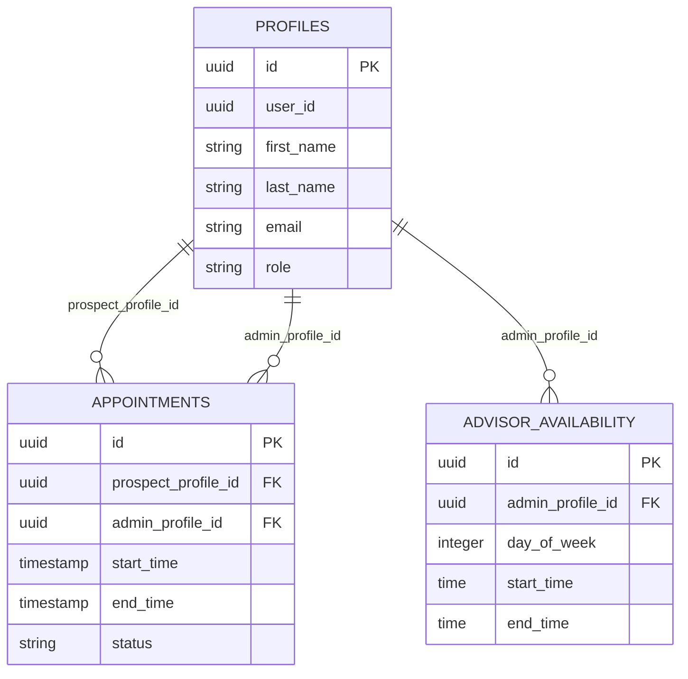
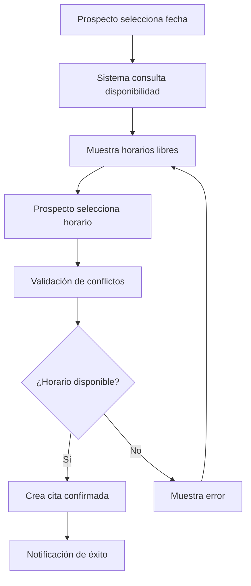
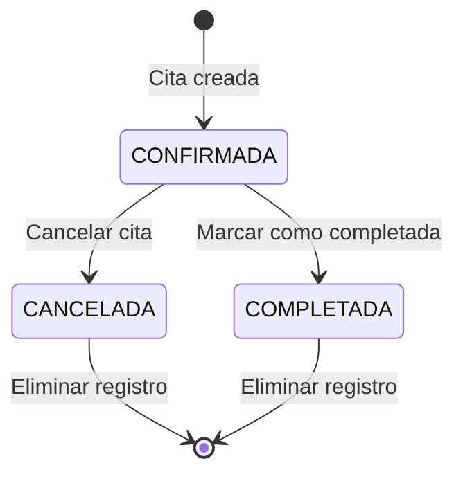
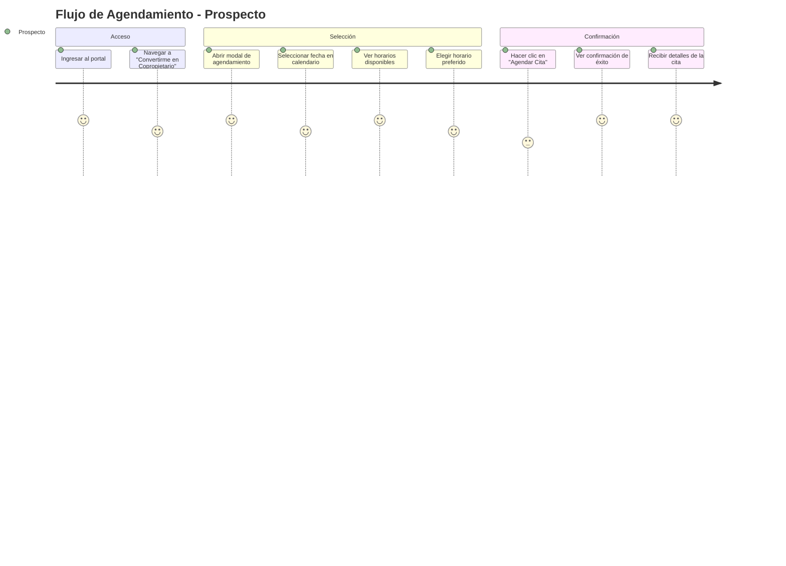
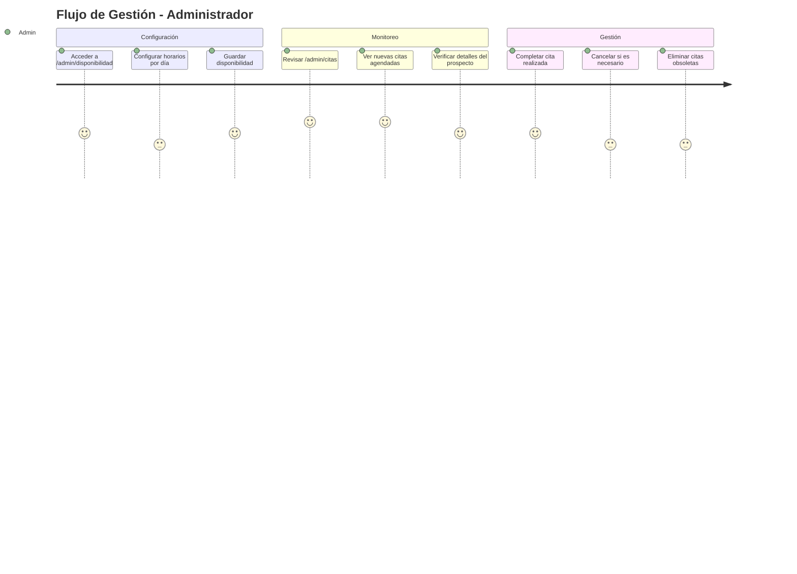

# Bloque 8 - Sistema de Agendamiento de Citas Completo

## Fractional Tulum - Documentación Técnica

***

## 1. Introducción y Objetivos del Bloque 8

### 1.1 Propósito

El Bloque 8 implementa un sistema completo de agendamiento de citas que permite a los prospectos programar llamadas con asesores de Fractional Tulum, mientras que los administradores pueden gestionar la disponibilidad y supervisar todas las citas agendadas.

### 1.2 Objetivos Principales

* **Agendamiento Intuitivo**: Interfaz simple para que prospectos seleccionen fecha y hora

* **Gestión de Disponibilidad**: Sistema para que administradores configuren horarios disponibles

* **Panel de Control**: Vista administrativa completa de todas las citas

* **Prevención de Conflictos**: Exclusión automática de horarios ocupados

* **Seguridad**: Políticas RLS que protegen la información de citas

***

## 2. Arquitectura del Sistema de Citas

### 2.1 Estructura de Base de Datos

#### Tabla `appointments`

```sql
CREATE TABLE appointments (
    id UUID PRIMARY KEY DEFAULT gen_random_uuid(),
    prospect_profile_id UUID REFERENCES profiles(id) ON DELETE CASCADE,
    admin_profile_id UUID REFERENCES profiles(id) ON DELETE CASCADE,
    start_time TIMESTAMP WITH TIME ZONE NOT NULL,
    end_time TIMESTAMP WITH TIME ZONE NOT NULL,
    status VARCHAR(20) DEFAULT 'CONFIRMADA' CHECK (status IN ('CONFIRMADA', 'CANCELADA', 'COMPLETADA')),
    created_at TIMESTAMP WITH TIME ZONE DEFAULT NOW(),
    updated_at TIMESTAMP WITH TIME ZONE DEFAULT NOW()
);
```

#### Tabla `advisor_availability`

```sql
CREATE TABLE advisor_availability (
    id UUID PRIMARY KEY DEFAULT gen_random_uuid(),
    admin_profile_id UUID REFERENCES profiles(id) ON DELETE CASCADE,
    day_of_week INTEGER NOT NULL CHECK (day_of_week >= 0 AND day_of_week <= 6),
    start_time TIME NOT NULL,
    end_time TIME NOT NULL,
    created_at TIMESTAMP WITH TIME ZONE DEFAULT NOW(),
    updated_at TIMESTAMP WITH TIME ZONE DEFAULT NOW()
);
```

### 2.2 Relaciones Entre Tablas



### 2.3 Políticas RLS Implementadas

#### Políticas para `appointments`

```sql
-- Los administradores pueden ver todas las citas
CREATE POLICY "Admins can view all appointments" ON appointments
    FOR SELECT USING (
        EXISTS (
            SELECT 1 FROM profiles 
            WHERE profiles.user_id = auth.uid() 
            AND profiles.role = 'ADMIN'
        )
    );

-- Los prospectos solo pueden ver sus propias citas
CREATE POLICY "Prospects can view own appointments" ON appointments
    FOR SELECT USING (
        prospect_profile_id IN (
            SELECT id FROM profiles WHERE user_id = auth.uid()
        )
    );

-- Usuarios autenticados pueden crear citas
CREATE POLICY "Authenticated users can create appointments" ON appointments
    FOR INSERT WITH CHECK (auth.role() = 'authenticated');
```

***

## 3. Funcionalidades Implementadas

### 3.1 Sistema de Disponibilidad de Asesores

#### Configuración por Día de Semana

* **Interfaz**: `/admin/disponibilidad`

* **Funcionalidad**: Permite configurar horarios de trabajo por día

* **Formato**: Horarios en formato 24h (ej: 09:00 - 17:00)

* **Flexibilidad**: Diferentes horarios para cada día de la semana

#### Ejemplo de Configuración

```typescript
// Lunes a Viernes: 9:00 AM - 5:00 PM
{
  day_of_week: 1, // Lunes
  start_time: "09:00",
  end_time: "17:00"
}
```

### 3.2 Agendamiento de Citas por Prospectos

#### Componente `AppointmentScheduler`

**Ubicación**: `src/components/scheduling/AppointmentScheduler.tsx`

**Características**:

* Calendario interactivo con fechas deshabilitadas (fines de semana, días pasados)

* Grid de horarios disponibles en intervalos de 1 hora

* Validación en tiempo real de disponibilidad

* Confirmación inmediata de cita

#### Flujo de Agendamiento



### 3.3 Panel de Administración de Citas

#### Vista `/admin/citas`

**Funcionalidades**:

* Lista completa de todas las citas agendadas

* Información detallada: cliente, contacto, fecha/hora, asesor

* Estados de cita con códigos de color

* Acciones: Completar, Cancelar, Eliminar

#### Tabla de Citas

```typescript
interface Appointment {
  id: string;
  prospect: {
    full_name: string;
    email: string;
  };
  admin: {
    full_name: string;
    email: string;
  };
  start_time: string;
  end_time: string;
  status: 'CONFIRMADA' | 'CANCELADA' | 'COMPLETADA';
}
```

### 3.4 Gestión de Estados de Citas

#### Estados Disponibles

* **CONFIRMADA** (Verde): Cita agendada y confirmada

* **CANCELADA** (Rojo): Cita cancelada por cualquier motivo

* **COMPLETADA** (Azul): Cita realizada exitosamente

#### Transiciones de Estado



### 3.5 Exclusión Automática de Horarios Ocupados

#### Algoritmo de Disponibilidad

```typescript
// Verificar si un slot se superpone con citas existentes
const isBooked = appointments.some(appt => {
  const apptStartTime = new Date(appt.start_time);
  const apptEndTime = new Date(appt.end_time);
  // Conflicto si: (InicioSlot < FinCita) y (FinSlot > InicioCita)
  return slotStartTime < apptEndTime && slotEndTime > apptStartTime;
});
```

***

## 4. Componentes y Archivos Creados

### 4.1 Componentes Frontend

#### `AppointmentScheduler.tsx`

**Ubicación**: `src/components/scheduling/AppointmentScheduler.tsx`
**Propósito**: Componente principal de agendamiento
**Características**:

* Calendario con react-day-picker

* Grid responsivo de horarios

* Estados de carga y validación

* Integración con Supabase

```typescript
interface AppointmentSchedulerProps {
  onAppointmentCreated?: () => void;
}

export function AppointmentScheduler({ onAppointmentCreated }: AppointmentSchedulerProps)
```

### 4.2 Páginas de Administración

#### `/admin/citas/page.tsx`

**Funcionalidades**:

* Lista de citas con paginación

* Filtros por estado y fecha

* Acciones en línea (completar, cancelar, eliminar)

* Actualización en tiempo real

#### `/admin/disponibilidad/page.tsx`

**Funcionalidades**:

* Configuración de horarios por día

* Vista de calendario semanal

* Guardado automático de cambios

* Validación de horarios

### 4.3 Server Actions

#### `appointments.ts`

**Ubicación**: `src/app/actions/appointments.ts`
**Funciones**:

* `getAppointmentsAction()`: Obtiene todas las citas para admin

* `updateAppointmentStatusAction()`: Cambia estado de cita

* `deleteAppointmentAction()`: Elimina cita

#### `availability.ts`

**Ubicación**: `src/app/actions/availability.ts`
**Funciones**:

* `getAvailableSlotsAction()`: Calcula horarios disponibles

* `createAppointmentAction()`: Crea nueva cita

* `getFirstAdminProfileAction()`: Obtiene asesor disponible

* `updateAvailabilityAction()`: Actualiza disponibilidad

### 4.4 Migraciones de Base de Datos

#### `022_create_appointment_system.sql`

* Creación de tablas `appointments` y `advisor_availability`

* Índices para optimización de consultas

* Triggers para `updated_at`

#### `023_fix_appointments_rls_policies.sql`

* Políticas RLS corregidas para appointments

* Permisos diferenciados por rol

* Seguridad mejorada

***

## 5. Bugs Corregidos

### 5.1 Problema de Visualización de Citas por Políticas RLS

#### Problema Identificado

* Las citas no aparecían en `/admin/citas`

* Política RLS muy restrictiva impedía acceso a administradores

#### Solución Implementada

```sql
-- Política anterior (restrictiva)
CREATE POLICY "Users can view own appointments" ON appointments
    FOR SELECT USING (
        prospect_profile_id = auth.uid() OR admin_profile_id = auth.uid()
    );

-- Política corregida (permite acceso admin)
CREATE POLICY "Admins can view all appointments" ON appointments
    FOR SELECT USING (
        EXISTS (
            SELECT 1 FROM profiles 
            WHERE profiles.user_id = auth.uid() 
            AND profiles.role = 'ADMIN'
        )
    );
```

### 5.2 Error de Columna 'full\_name' Inexistente

#### Problema Identificado

* Query SQL buscaba `full_name` en tabla `profiles`

* La tabla solo tenía `first_name` y `last_name`

* Error: `column "full_name" does not exist`

#### Solución Implementada

```typescript
// Query corregida
const { data: appointments, error } = await supabase
  .from('appointments')
  .select(`
    id,
    start_time,
    end_time,
    status,
    prospect:profiles!prospect_profile_id(
      first_name,
      last_name,
      email
    ),
    admin:profiles!admin_profile_id(
      first_name,
      last_name,
      email
    )
  `);

// Transformación de datos
const transformedAppointments = appointments.map(apt => ({
  ...apt,
  prospect: {
    ...apt.prospect,
    full_name: `${apt.prospect.first_name} ${apt.prospect.last_name}`
  },
  admin: {
    ...apt.admin,
    full_name: `${apt.admin.first_name} ${apt.admin.last_name}`
  }
}));
```

### 5.3 Bug de Horarios Ocupados Apareciendo como Disponibles

#### Problema Identificado

* Consulta incorrecta para obtener citas existentes

* Filtro `.lte('end_time', endOfDay.toISOString())` era incorrecto

* Horarios ocupados aparecían como disponibles

#### Solución Implementada

```typescript
// Query anterior (incorrecta)
const { data: appointments } = await supabase
  .from('appointments')
  .select('start_time, end_time')
  .gte('start_time', startOfDay.toISOString())
  .lte('end_time', endOfDay.toISOString()); // ❌ Incorrecto

// Query corregida
const { data: appointments } = await supabase
  .from('appointments')
  .select('start_time, end_time')
  .gte('start_time', startOfDay.toISOString())
  .lt('start_time', endOfDay.toISOString()) // ✅ Correcto
  .eq('status', 'CONFIRMADA'); // ✅ Solo citas confirmadas
```

***

## 6. Flujo de Usuario

### 6.1 Proceso Completo de Agendamiento

#### Desde la Perspectiva del Prospecto



#### Desde la Perspectiva del Administrador



### 6.2 Experiencia del Prospecto vs Administrador

#### Prospecto

* **Acceso**: Portal público con botón "Convertirme en Copropietario"

* **Interfaz**: Modal simple con calendario y horarios

* **Restricciones**: Solo puede agendar, no ver citas existentes

* **Feedback**: Confirmación inmediata y mensajes de error claros

#### Administrador

* **Acceso**: Panel administrativo completo

* **Interfaz**: Tablas detalladas con filtros y acciones

* **Permisos**: Ver todas las citas, gestionar estados, configurar disponibilidad

* **Herramientas**: Búsqueda, filtros, exportación de datos

***

## 7. Consideraciones Técnicas

### 7.1 Manejo de Zonas Horarias (UTC)

#### Estrategia Implementada

* **Almacenamiento**: Todas las fechas en UTC en la base de datos

* **Conversión**: Conversión automática en el frontend según zona local

* **Consistencia**: Uso de `setUTCHours()` para evitar problemas de DST

```typescript
// Ejemplo de manejo correcto de fechas
const appointmentDateTime = new Date(selectedDate.toISOString());
appointmentDateTime.setUTCHours(hour, minute, 0, 0);

// Verificación de validez
if (isNaN(appointmentDateTime.getTime())) {
  throw new Error('Fecha inválida');
}
```

### 7.2 Validaciones de Conflictos de Horarios

#### Doble Validación

1. **Frontend**: Exclusión de horarios ocupados en `getAvailableSlotsAction`
2. **Backend**: Verificación final en `createAppointmentAction`

```typescript
// Validación de conflictos en creación
const { data: existingAppointment } = await supabase
  .from('appointments')
  .select('id')
  .eq('admin_profile_id', appointmentDetails.adminProfileId)
  .lt('start_time', new Date(appointmentDetails.endTime).toISOString())
  .gt('end_time', startTimeISO)
  .in('status', ['CONFIRMADA'])
  .limit(1)
  .single();

if (existingAppointment) {
  return { success: false, error: 'Este horario acaba de ser ocupado.' };
}
```

### 7.3 Políticas de Seguridad RLS

#### Principios de Seguridad

* **Separación de Roles**: Administradores vs Prospectos

* **Acceso Mínimo**: Cada rol solo ve lo necesario

* **Validación Doble**: RLS + validación en aplicación

#### Implementación de Políticas

```sql
-- Política para lectura de citas
CREATE POLICY "Role-based appointment access" ON appointments
    FOR SELECT USING (
        CASE 
            WHEN EXISTS (SELECT 1 FROM profiles WHERE user_id = auth.uid() AND role = 'ADMIN')
            THEN true  -- Admins ven todo
            ELSE prospect_profile_id IN (SELECT id FROM profiles WHERE user_id = auth.uid())
            -- Prospectos solo sus citas
        END
    );
```

### 7.4 Optimizaciones de Performance

#### Índices de Base de Datos

```sql
-- Índices para consultas frecuentes
CREATE INDEX idx_appointments_start_time ON appointments(start_time);
CREATE INDEX idx_appointments_admin_profile ON appointments(admin_profile_id);
CREATE INDEX idx_appointments_status ON appointments(status);
CREATE INDEX idx_availability_day_admin ON advisor_availability(day_of_week, admin_profile_id);
```

#### Caching y Revalidación

```typescript
// Revalidación automática después de cambios
revalidatePath('/admin/citas');
revalidatePath('/admin/disponibilidad');
```

***

## 8. Ejemplos de Código Relevantes

### 8.1 Componente de Agendamiento

```typescript
// AppointmentScheduler.tsx - Función principal de agendamiento
const handleCreateAppointment = async () => {
  if (!selectedDate || !selectedSlot || !prospectProfileId) {
    toast.error('Por favor, selecciona una fecha y un horario.');
    return;
  }

  setIsCreatingAppointment(true);
  
  const [hour, minute] = selectedSlot.split(':').map(Number);
  const appointmentDateTime = new Date(selectedDate.toISOString());
  appointmentDateTime.setUTCHours(hour, minute, 0, 0);

  // Obtener admin disponible
  const adminResult = await getFirstAdminProfileAction();
  if (!adminResult.success) {
    toast.error('No hay asesores disponibles');
    return;
  }
  
  const appointmentData = {
    prospectProfileId,
    adminProfileId: adminResult.adminProfileId!,
    startTime: appointmentDateTime,
    endTime: new Date(appointmentDateTime.getTime() + 60 * 60000)
  };
  
  const result = await createAppointmentAction(appointmentData);
  
  if (result.success) {
    toast.success('Tu cita ha sido confirmada exitosamente!');
    onAppointmentCreated?.();
  } else {
    toast.error(result.error || 'No se pudo agendar la cita.');
  }
  
  setIsCreatingAppointment(false);
};
```

### 8.2 Cálculo de Horarios Disponibles

```typescript
// availability.ts - Función para calcular slots disponibles
export async function getAvailableSlotsAction(selectedDate: Date) {
  const startOfDay = new Date(selectedDate.setUTCHours(0, 0, 0, 0));
  const endOfDay = new Date(selectedDate.setUTCHours(23, 59, 59, 999));
  const dayOfWeek = selectedDate.getUTCDay();

  const supabase = await createSupabaseServerClient();

  // 1. Obtener disponibilidad del asesor
  const { data: availability } = await supabase
    .from('advisor_availability')
    .select('start_time, end_time')
    .eq('day_of_week', dayOfWeek)
    .single();

  if (!availability) {
    return { success: true, slots: [] };
  }

  // 2. Obtener citas existentes
  const { data: appointments } = await supabase
    .from('appointments')
    .select('start_time, end_time')
    .gte('start_time', startOfDay.toISOString())
    .lt('start_time', endOfDay.toISOString())
    .eq('status', 'CONFIRMADA');

  // 3. Calcular slots disponibles
  const availableSlots = [];
  const slotDuration = 60; // minutos

  const [startHour, startMinute] = availability.start_time.split(':').map(Number);
  const [endHour, endMinute] = availability.end_time.split(':').map(Number);

  const currentSlot = new Date(startOfDay);
  currentSlot.setUTCHours(startHour, startMinute);

  const endSlot = new Date(startOfDay);
  endSlot.setUTCHours(endHour, endMinute);

  while (currentSlot < endSlot) {
    const slotStartTime = new Date(currentSlot);
    const slotEndTime = new Date(slotStartTime.getTime() + slotDuration * 60000);

    // Verificar conflictos
    const isBooked = appointments?.some(appt => {
      const apptStartTime = new Date(appt.start_time);
      const apptEndTime = new Date(appt.end_time);
      return slotStartTime < apptEndTime && slotEndTime > apptStartTime;
    });

    if (!isBooked) {
      availableSlots.push(
        slotStartTime.toLocaleTimeString('en-GB', { 
          hour: '2-digit', 
          minute: '2-digit', 
          timeZone: 'UTC' 
        })
      );
    }
    
    currentSlot.setMinutes(currentSlot.getMinutes() + slotDuration);
  }
  
  return { success: true, slots: availableSlots };
}
```

### 8.3 Gestión de Estados de Citas

```typescript
// appointments.ts - Actualización de estado de cita
export async function updateAppointmentStatusAction(
  appointmentId: string, 
  newStatus: 'CONFIRMADA' | 'CANCELADA' | 'COMPLETADA'
) {
  const supabase = await createSupabaseServerClient();
  
  // Verificar permisos de admin
  const { data: { user } } = await supabase.auth.getUser();
  if (!user) {
    return { success: false, error: 'No autenticado' };
  }

  const { data: profile } = await supabase
    .from('profiles')
    .select('role')
    .eq('user_id', user.id)
    .single();

  if (profile?.role !== 'ADMIN') {
    return { success: false, error: 'Sin permisos de administrador' };
  }

  // Actualizar estado
  const { error } = await supabase
    .from('appointments')
    .update({ 
      status: newStatus,
      updated_at: new Date().toISOString()
    })
    .eq('id', appointmentId);

  if (error) {
    return { success: false, error: 'Error al actualizar la cita' };
  }

  revalidatePath('/admin/citas');
  return { success: true };
}
```

***

## 9. Capturas de Pantalla Conceptuales

### 9.1 Modal de Agendamiento (Prospecto)

```
┌─────────────────────────────────────────────────────────────┐
│                    Agenda tu llamada final                  │
│                                                             │
│  Selecciona una fecha          │    Horarios disponibles    │
│                               │                             │
│  ┌─────────────────────────┐   │   ┌─────┐ ┌─────┐ ┌─────┐  │
│  │     August 2025         │   │   │08:00│ │09:00│ │10:00│  │
│  │ Su Mo Tu We Th Fr Sa    │   │   └─────┘ └─────┘ └─────┘  │
│  │     1  2  3  4  5  6    │   │                             │
│  │  7  8  9 10 11 12 13    │   │   ┌─────┐ ┌─────┐ ┌─────┐  │
│  │ 14 15 16 17 18 19 20    │   │   │11:00│ │12:00│ │13:00│  │
│  │ 21 22 23 24 25 26 27    │   │   └─────┘ └─────┘ └─────┘  │
│  │ 28 29 30 31             │   │                             │
│  └─────────────────────────┘   │   ┌─────┐ ┌─────┐ ┌─────┐  │
│                               │   │15:00│ │16:00│ │17:00│  │
│                               │   └─────┘ └─────┘ └─────┘  │
│                               │                             │
│                               │   ┌─────┐                  │
│                               │   │18:00│                  │
│                               │   └─────┘                  │
│                               │                             │
│                               │  ┌─────────────────────┐   │
│                               │  │    Agendar Cita     │   │
│                               │  └─────────────────────┘   │
└─────────────────────────────────────────────────────────────┘
```

### 9.2 Panel de Administración de Citas

```
┌─────────────────────────────────────────────────────────────────────────────────────┐
│  Gestión de Citas                                                    [Actualizar]   │
│  Administra las citas agendadas por los prospectos                                  │
│                                                                                     │
│  📅 Citas Agendadas                                                                │
│  2 citas en total                                                                   │
│                                                                                     │
│ ┌─────────────────────────────────────────────────────────────────────────────────┐ │
│ │Cliente          │Contacto              │Fecha y Hora        │Asesor    │Estado │ │
│ ├─────────────────────────────────────────────────────────────────────────────────┤ │
│ │👤 Fractional    │📧 tulum@gmail.com    │📅 jueves, 28 de   │Usuario   │🟢     │ │
│ │   Tulum         │                      │   agosto de 2025   │Google    │CONF   │ │
│ │                 │                      │⏰ 09:00 - 10:00   │          │       │ │
│ │                 │                      │                    │          │[✓][✗][🗑]│
│ ├─────────────────────────────────────────────────────────────────────────────────┤ │
│ │👤 Fractional    │📧 tulum@gmail.com    │📅 miércoles, 27   │Usuario   │🟢     │ │
│ │   Tulum         │                      │   de agosto 2025   │Google    │CONF   │ │
│ │                 │                      │⏰ 04:00 - 05:00   │          │       │ │
│ │                 │                      │                    │          │[✓][✗][🗑]│
│ └─────────────────────────────────────────────────────────────────────────────────┘ │
└─────────────────────────────────────────────────────────────────────────────────────┘
```

### 9.3 Configuración de Disponibilidad

```
┌─────────────────────────────────────────────────────────────────────────────────────┐
│  Gestión de Disponibilidad                                           [Guardar]      │
│  Configura los horarios disponibles para citas                                     │
│                                                                                     │
│  📅 Horarios por Día de la Semana                                                  │
│                                                                                     │
│ ┌─────────────────────────────────────────────────────────────────────────────────┐ │
│ │ Día        │ Disponible │ Hora Inicio │ Hora Fin │ Acciones                    │ │
│ ├─────────────────────────────────────────────────────────────────────────────────┤ │
│ │ Lunes      │ ☑️ Sí      │ 09:00       │ 17:00    │ [Editar] [Eliminar]        │ │
│ │ Martes     │ ☑️ Sí      │ 09:00       │ 17:00    │ [Editar] [Eliminar]        │ │
│ │ Miércoles  │ ☑️ Sí      │ 09:00       │ 17:00    │ [Editar] [Eliminar]        │ │
│ │ Jueves     │ ☑️ Sí      │ 09:00       │ 17:00    │ [Editar] [Eliminar]        │ │
│ │ Viernes    │ ☑️ Sí      │ 09:00       │ 17:00    │ [Editar] [Eliminar]        │ │
│ │ Sábado     │ ❌ No      │ --          │ --       │ [Agregar Horario]          │ │
│ │ Domingo    │ ❌ No      │ --          │ --       │ [Agregar Horario]          │ │
│ └─────────────────────────────────────────────────────────────────────────────────┘ │
│                                                                                     │
│  ℹ️ Los horarios se muestran en formato 24 horas                                   │
│  ℹ️ Las citas se programan en intervalos de 1 hora                                 │
└─────────────────────────────────────────────────────────────────────────────────────┘
```

***

## 10. Conclusiones y Próximos Pasos

### 10.1 Estado Actual del Sistema

✅ **Completamente Funcional**

* Agendamiento de citas operativo

* Panel de administración completo

* Gestión de disponibilidad implementada

* Bugs críticos corregidos

* Políticas de seguridad establecidas

### 10.2 Mejoras Futuras Sugeridas

#### Funcionalidades Adicionales

* **Notificaciones por Email**: Confirmaciones automáticas de citas

* **Recordatorios**: Sistema de recordatorios 24h antes

* **Reagendamiento**: Permitir cambiar fecha/hora de citas existentes

* **Múltiples Asesores**: Soporte para varios asesores con disponibilidades independientes

* **Integración de Calendario**: Sincronización con Google Calendar/Outlook

#### Optimizaciones Técnicas

* **Cache de Disponibilidad**: Reducir consultas repetitivas

* **Paginación Avanzada**: Para listas grandes de citas

* **Filtros Avanzados**: Búsqueda por rango de fechas, asesor, estado

* **Exportación de Datos**: CSV/Excel de citas para reportes

* **Analytics**: Métricas de conversión y uso del sistema

### 10.3 Métricas de Éxito

* **Tiempo de Agendamiento**: < 2 minutos desde selección hasta confirmación

* **Tasa de Error**: < 1% en conflictos de horarios

* **Satisfacción del Usuario**: Interfaz intuitiva y sin fricciones

* **Eficiencia Administrativa**: Gestión centralizada de todas las citas

***

**Documentación generada para Fractional Tulum - Bloque 8**\
**Fecha**: Enero 2025\
**Versión**: 1.0\
**Estado**: Producción

***

