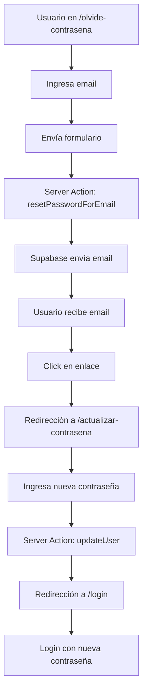
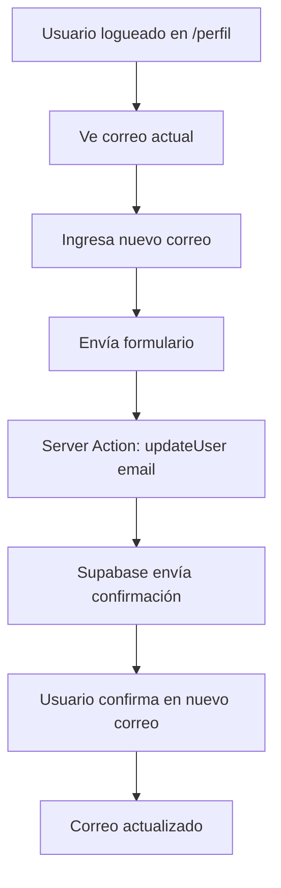

# Fractional Tulum - Bloque 4.5: Implementación de Gestión de Cuenta

## 1. Misión y Objetivos del Bloque

**Misión Única:** Construir las páginas y la lógica necesarias para que un usuario pueda restablecer una contraseña olvidada y cambiar su dirección de correo electrónico de forma segura.

**Objetivos Específicos:**

* Implementar flujo completo de recuperación de contraseña

* Crear sistema seguro de actualización de contraseña

* Desarrollar funcionalidad de cambio de correo electrónico

* Garantizar la seguridad en todos los procesos de gestión de cuenta

## 2. Prerrequisitos

* **Bloque 4 completado:** Sistema de autenticación (login/registro) funcional

* Supabase configurado y operativo

* shadcn/ui instalado y configurado

* Next.js 14 con App Router

* Server Actions habilitadas

## 3. Tareas Detalladas

### 3.1 TAREA 4.5.1: Página "Olvidé mi Contraseña"

**Ruta:** `/src/app/(auth)/olvide-contrasena/page.tsx`
**Endpoint:** `/olvide-contrasena`

#### Especificaciones UI:

```tsx
// Estructura del componente
<Card className="w-full max-w-md mx-auto">
  <CardHeader>
    <CardTitle>Restablecer Contraseña</CardTitle>
    <CardDescription>
      Ingresa tu correo electrónico y te enviaremos un enlace para restablecer tu contraseña.
    </CardDescription>
  </CardHeader>
  <CardContent>
    <Input type="email" placeholder="correo@ejemplo.com" />
    <Button>Enviar Instrucciones</Button>
  </CardContent>
</Card>
```

#### Server Action:

```tsx
// resetPasswordAction
async function resetPasswordAction(email: string) {
  const supabase = createServerActionClient();
  
  const { error } = await supabase.auth.resetPasswordForEmail(email, {
    redirectTo: 'http://localhost:3000/actualizar-contrasena'
  });
  
  if (error) {
    return { success: false, error: error.message };
  }
  
  return { success: true, message: 'Instrucciones enviadas a tu correo' };
}
```

### 3.2 TAREA 4.5.2: Página "Actualizar Contraseña"

**Ruta:** `/src/app/(auth)/actualizar-contrasena/page.tsx`
**Endpoint:** `/actualizar-contrasena`
**Tipo:** Client Component (`'use client'`)

#### Especificaciones UI:

```tsx
// Estructura del componente
<Card className="w-full max-w-md mx-auto">
  <CardHeader>
    <CardTitle>Crea tu Nueva Contraseña</CardTitle>
  </CardHeader>
  <CardContent>
    <Input type="password" placeholder="Nueva Contraseña" />
    <Input type="password" placeholder="Confirmar Nueva Contraseña" />
    <Button>Guardar y Actualizar</Button>
  </CardContent>
</Card>
```

#### Lógica Client/Server:

```tsx
// Client Component para manejar tokens de URL
'use client';

// Server Action para actualizar contraseña
async function updatePasswordAction(password: string) {
  const supabase = createServerActionClient();
  
  const { error } = await supabase.auth.updateUser({
    password: password
  });
  
  if (error) {
    return { success: false, error: error.message };
  }
  
  return { success: true };
}
```

### 3.3 TAREA 4.5.3: Actualización de Página "Mi Perfil"

**Ruta:** `/src/app/copropietario/perfil/page.tsx`
**Modificación:** Añadir sección de cambio de correo

#### Nueva Sección UI:

```tsx
// Sección adicional en el perfil
<Card>
  <CardHeader>
    <CardTitle>Cambiar Correo Electrónico</CardTitle>
  </CardHeader>
  <CardContent>
    <p>Correo actual: {user.email}</p>
    <Input type="email" placeholder="Nueva dirección de correo" />
    <Button>Actualizar Correo</Button>
  </CardContent>
</Card>
```

#### Server Action:

```tsx
// updateEmailAction
async function updateEmailAction(newEmail: string) {
  const supabase = createServerActionClient();
  
  const { error } = await supabase.auth.updateUser({
    email: newEmail
  });
  
  if (error) {
    return { success: false, error: error.message };
  }
  
  return { 
    success: true, 
    message: 'Hemos enviado un enlace de confirmación a tu nueva dirección de correo.' 
  };
}
```

## 4. Especificaciones Técnicas

### 4.1 Componentes shadcn/ui Requeridos

* `Card`, `CardHeader`, `CardTitle`, `CardDescription`, `CardContent`

* `Input` (tipos: email, password)

* `Button`

* `Alert` (para mensajes de estado)

### 4.2 Gestión de Estados

```tsx
// Estados para formularios
const [email, setEmail] = useState('');
const [password, setPassword] = useState('');
const [confirmPassword, setConfirmPassword] = useState('');
const [loading, setLoading] = useState(false);
const [message, setMessage] = useState('');
```

### 4.3 Validaciones

* Email: formato válido

* Contraseña: mínimo 8 caracteres

* Confirmación: coincidencia con contraseña

* Manejo de errores de Supabase

## 5. Flujos de Proceso

### 5.1 Flujo de Reset de Contraseña



### 5.2 Flujo de Cambio de Correo



## 6. Gestión de Tokens de Supabase

### 6.1 Token de Reset de Contraseña

* Supabase incluye tokens en URL de redirección

* Componente cliente debe extraer y validar tokens

* Tokens tienen expiración automática

### 6.2 Configuración de redirectTo

```tsx
// Configuración para diferentes entornos
const getRedirectUrl = () => {
  const baseUrl = process.env.NODE_ENV === 'production' 
    ? 'https://tu-dominio.com' 
    : 'http://localhost:3000';
  return `${baseUrl}/actualizar-contrasena`;
};
```

## 7. Criterios de Verificación

### 7.1 Funcionalidad de Reset de Contraseña

* [ ] Usuario puede acceder a `/olvide-contrasena`

* [ ] Formulario envía email correctamente

* [ ] Usuario recibe email de Supabase

* [ ] Enlace en email redirige a `/actualizar-contrasena`

* [ ] Usuario puede establecer nueva contraseña

* [ ] Redirección exitosa a `/login`

* [ ] Login funciona con nueva contraseña

### 7.2 Funcionalidad de Cambio de Correo

* [ ] Usuario logueado ve formulario en perfil

* [ ] Correo actual se muestra correctamente

* [ ] Formulario envía nuevo correo

* [ ] Usuario recibe email de confirmación

* [ ] Confirmación actualiza el correo en Supabase

### 7.3 Validaciones y Seguridad

* [ ] Validación de formato de email

* [ ] Validación de longitud de contraseña

* [ ] Confirmación de contraseña funciona

* [ ] Manejo de errores de Supabase

* [ ] Mensajes de éxito/error apropiados

## 8. Comandos de Verificación

### 8.1 Verificación de Tipos

```powershell
npx tsc --noEmit
```

### 8.2 Verificación de Rutas

```powershell
# Verificar que las páginas existen
ls src/app/(auth)/olvide-contrasena/page.tsx
ls src/app/(auth)/actualizar-contrasena/page.tsx
ls src/app/copropietario/perfil/page.tsx
```

### 8.3 Pruebas Funcionales

1. Navegar a `http://localhost:3000/olvide-contrasena`
2. Ingresar email válido y enviar
3. Verificar recepción de email
4. Seguir enlace de reset
5. Establecer nueva contraseña
6. Verificar login con nueva contraseña
7. Navegar a perfil y probar cambio de correo

## 9. Estructura de Archivos Resultante

```
src/
├── app/
│   ├── (auth)/
│   │   ├── login/
│   │   │   └── page.tsx
│   │   ├── registro/
│   │   │   └── page.tsx
│   │   ├── olvide-contrasena/          # NUEVO
│   │   │   └── page.tsx               # NUEVO
│   │   └── actualizar-contrasena/      # NUEVO
│   │       └── page.tsx               # NUEVO
│   └── copropietario/
│       └── perfil/
│           └── page.tsx               # MODIFICADO
├── lib/
│   ├── supabase/
│   │   ├── client.ts
│   │   └── server.ts
│   └── actions/
│       ├── auth-actions.ts
│       ├── reset-password-actions.ts  # NUEVO
│       └── profile-actions.ts         # NUEVO
└── components/
    └── ui/
        ├── card.tsx
        ├── input.tsx
        ├── button.tsx
        └── alert.tsx
```

## 10. Consideraciones de Seguridad

### 10.1 Validaciones del Lado del Servidor

* Validar formato de email en Server Actions

* Verificar longitud y complejidad de contraseña

* Sanitizar inputs antes de enviar a Supabase

### 10.2 Manejo de Errores

* No exponer detalles técnicos al usuario

* Logs apropiados para debugging

* Mensajes de error user-friendly

### 10.3 Rate Limiting

* Considerar implementar límites en requests de reset

* Prevenir spam de emails de recuperación

## 11. Notas de Implementación

* Usar `'use client'` solo en `/actualizar-contrasena` para manejo de tokens

* Mantener Server Actions en archivos separados para mejor organización

* Implementar loading states en todos los formularios

* Añadir toast notifications para mejor UX

* Considerar implementar progress indicators en flujos multi-paso

