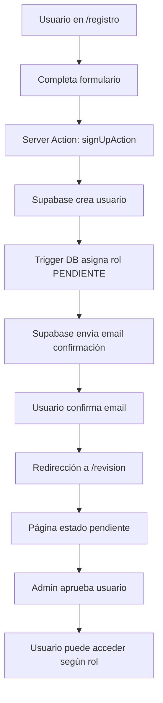
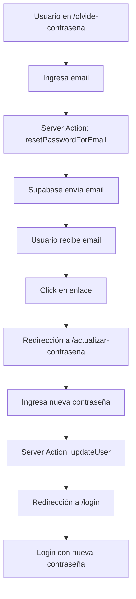

# Inicialización del Frontend - Fractional Tulum

## 1. Resumen del Bloque 2

**Misión:** Inicializar un proyecto Next.js completo en la carpeta actual (Tulum Fractional), configurar la conexión con Supabase e instalar la librería de componentes shadcn/ui.

**Prerrequisitos:**

* ✅ Bloque 1 (Base de Datos) completado en Supabase

* ✅ Bloque 1.6 (Seguridad RLS) implementado en Supabase

* 📁 Carpeta raíz del proyecto "tulum\_fractional" disponible

## 2. Tareas de Implementación

### 2.1 Inicialización de Next.js

#### Comando de Inicialización

```powershell
npx create-next-app@latest .
```

> **⚠️ IMPORTANTE:** El punto `.` al final es obligatorio para instalar en el directorio actual.

#### Configuración Requerida

Responder a las preguntas del asistente con estos valores exactos:

| Pregunta        | Respuesta |
| --------------- | --------- |
| TypeScript?     | **Yes**   |
| ESLint?         | **Yes**   |
| Tailwind CSS?   | **Yes**   |
| src/ directory? | **Yes**   |
| App Router?     | **Yes**   |
| Turbopack?      | **Yes**   |
| Import alias?   | **No**    |

#### Verificación de Estructura

Después de la instalación, confirmar que existen estos archivos/carpetas:

```
tulum_fractional/
├── package.json
├── next.config.js
├── tailwind.config.js
├── tsconfig.json
├── src/
│   └── app/
│       ├── layout.tsx
│       ├── page.tsx
│       └── globals.css
└── public/
```

### 2.2 Configuración de Variables de Entorno

#### Creación del Archivo .env.local

Crear en la raíz del proyecto:

```env
# Configuración de Supabase
NEXT_PUBLIC_SUPABASE_URL=TU_URL_DE_SUPABASE
NEXT_PUBLIC_SUPABASE_ANON_KEY=TU_LLAVE_ANON_DE_SUPABASE
SUPABASE_SERVICE_ROLE_KEY=your_supabase_service_role_key

# Site URL for authentication redirects
NEXT_PUBLIC_SITE_URL=http://localhost:3000

# Environment
NODE_ENV=development
```

#### Obtención de Credenciales

1. Acceder al panel de Supabase
2. Ir a **Project Settings > API**
3. Copiar:

   * **Project URL** → `NEXT_PUBLIC_SUPABASE_URL`
   * **Project API keys > anon public** → `NEXT_PUBLIC_SUPABASE_ANON_KEY`
   * **Project API keys > service_role** → `SUPABASE_SERVICE_ROLE_KEY`
   * **Site URL** → `NEXT_PUBLIC_SITE_URL` (http://localhost:3000 para desarrollo)

**Descripción de variables:**
- `NEXT_PUBLIC_SUPABASE_URL`: URL de tu proyecto Supabase
- `NEXT_PUBLIC_SUPABASE_ANON_KEY`: Clave anónima de Supabase (segura para el frontend)
- `SUPABASE_SERVICE_ROLE_KEY`: Clave de servicio de Supabase (solo para backend, nunca exponer en frontend)
- `NEXT_PUBLIC_SITE_URL`: URL base del sitio para redirects de autenticación (login/logout, confirmación de email)

#### Verificación

* ✅ Archivo `.env.local` creado en la raíz

* ✅ Variables pobladas con valores reales de Supabase

### 2.3 Instalación de shadcn/ui

#### Inicialización de shadcn/ui

```powershell
npx shadcn-ui@latest init
```

#### Configuración de shadcn/ui

Seleccionar estas opciones durante la configuración:

* **Color scheme:** Stone (obligatorio)

* Aceptar configuraciones por defecto para el resto

#### Instalación de Componentes Base

```powershell
npx shadcn-ui@latest add card button input label badge dropdown-menu table select
```

#### Verificación de Componentes

Confirmar que se creó la estructura:

```
src/
├── components/
│   └── ui/
│       ├── card.tsx
│       ├── button.tsx
│       ├── input.tsx
│       ├── label.tsx
│       ├── badge.tsx
│       ├── dropdown-menu.tsx
│       ├── table.tsx
│       └── select.tsx
└── lib/
    └── utils.ts
```

## 3. Comandos de Verificación

### 3.1 Verificación de Instalación

```powershell
# Verificar dependencias
npm list

# Verificar tipos TypeScript
npx tsc --noEmit

# Iniciar servidor de desarrollo
npm run dev
```

### 3.2 Verificación de Funcionamiento

* ✅ El proyecto inicia sin errores en `http://localhost:3000`

* ✅ No hay errores de TypeScript

* ✅ Tailwind CSS está funcionando

* ✅ Los componentes de shadcn/ui están disponibles

## 4. Mapa de Rutas del Sistema

### 4.1 Rutas de Autenticación (Grupo: auth)

| Ruta | Archivo | Descripción | Implementado |
|------|---------|-------------|-------------|
| `/iniciar-sesion` | `src/app/(auth)/iniciar-sesion/page.tsx` | Página de inicio de sesión | ✅ Bloque 4 |
| `/registro` | `src/app/(auth)/registro/page.tsx` | Página de registro de usuarios | ✅ Bloque 4 |
| `/olvide-contrasena` | `src/app/(auth)/olvide-contrasena/page.tsx` | Solicitud de reset de contraseña | ✅ Bloque 4.5 |
| `/actualizar-contrasena` | `src/app/(auth)/actualizar-contrasena/page.tsx` | Establecer nueva contraseña | ✅ Bloque 4.5 |

### 4.1.1 Rutas de Estado de Usuario

| Ruta | Archivo | Descripción | Implementado |
|------|---------|-------------|-------------|
| `/revision` | `src/app/revision/page.tsx` | Página de estado pendiente | ✅ **NUEVO** |
| `/acceso-denegado` | `src/app/acceso-denegado/page.tsx` | Página de acceso denegado | ✅ **NUEVO** |

### 4.2 Rutas Públicas (Grupo: public)

| Ruta | Archivo | Descripción | Estado |
|------|---------|-------------|--------|
| `/` | `src/app/(public)/page.tsx` | Página de inicio pública | 📋 Planificado |
| `/propiedades` | `src/app/(public)/propiedades/page.tsx` | Listado público de propiedades | 📋 Planificado |

### 4.3 Rutas de Copropietario

| Ruta | Archivo | Descripción | Estado |
|------|---------|-------------|--------|
| `/copropietario/dashboard` | `src/app/copropietario/dashboard/page.tsx` | Panel principal del copropietario | 📋 Planificado |
| `/copropietario/perfil` | `src/app/copropietario/perfil/page.tsx` | Perfil y gestión de cuenta | ✅ Bloque 4.5 |
| `/copropietario/propiedades` | `src/app/copropietario/propiedades/page.tsx` | Gestión de propiedades | 📋 Planificado |

### 4.4 Rutas de Prospecto

| Ruta | Archivo | Descripción | Estado |
|------|---------|-------------|--------|
| `/prospecto/bienvenida` | `src/app/prospecto/bienvenida/page.tsx` | Panel del prospecto | 📋 Planificado |
| `/prospecto/buscar` | `src/app/prospecto/buscar/page.tsx` | Búsqueda de propiedades | 📋 Planificado |

### 4.5 Rutas de Administrador

| Ruta | Archivo | Descripción | Estado |
|------|---------|-------------|--------|
| `/admin/dashboard` | `src/app/admin/dashboard/page.tsx` | Panel de administración | 📋 Planificado |
| `/admin/usuarios` | `src/app/admin/usuarios/page.tsx` | Gestión de usuarios | 📋 Planificado |
| `/admin/propiedades` | `src/app/admin/propiedades/page.tsx` | Gestión de propiedades | 📋 Planificado |

## 5. Estructura Final del Proyecto

```
tulum_fractional/
├── .env.local                 # Variables de entorno
├── .eslintrc.json            # Configuración ESLint
├── .gitignore                # Archivos ignorados por Git
├── next.config.js            # Configuración Next.js
├── package.json              # Dependencias del proyecto
├── tailwind.config.js        # Configuración Tailwind
├── tsconfig.json             # Configuración TypeScript
├── components.json           # Configuración shadcn/ui
├── public/                   # Archivos estáticos
├── src/
│   ├── app/                  # App Router de Next.js
│   │   ├── (auth)/           # Grupo de rutas de autenticación
│   │   │   ├── iniciar-sesion/       # Página de login
│   │   │   ├── registro/     # Página de registro
│   │   │   ├── olvide-contrasena/     # Reset de contraseña ✨ NUEVO
│   │   │   └── actualizar-contrasena/ # Nueva contraseña ✨ NUEVO
│   │   ├── (public)/         # Grupo de rutas públicas
│   │   ├── actions/          # Server Actions
│   │   ├── admin/            # Rutas de administrador
│   │   ├── copropietario/    # Rutas de copropietario
│   │   │   └── perfil/       # Perfil (actualizado con cambio de email) ✨ ACTUALIZADO
│   │   ├── prospecto/        # Rutas de prospecto
│   │   ├── revision/         # Página de estado pendiente ✨ NUEVO
│   │   │   └── page.tsx      # Estado de cuenta pendiente
│   │   ├── acceso-denegado/  # Página de acceso denegado ✨ NUEVO
│   │   │   └── page.tsx      # Acceso no autorizado
│   │   ├── globals.css       # Estilos globales
│   │   ├── layout.tsx        # Layout principal
│   │   └── page.tsx          # Página de inicio
│   ├── middleware.ts         # Middleware de protección de rutas ✨ NUEVO
│   ├── components/           # Componentes React
│   │   ├── Navbar.tsx        # Barra de navegación
│   │   └── ui/               # Componentes shadcn/ui
│   └── lib/                  # Utilidades y configuraciones
│       ├── supabase.ts       # Cliente Supabase
│       └── utils.ts          # Funciones utilitarias
├── supabase/                 # Migraciones de base de datos
│   └── migrations/           # Scripts SQL
└── .trae/                    # Documentación del proyecto
    └── documents/            # Documentos técnicos
```

## 6. Sistema de Protección de Rutas y Seguridad

### 6.1 Middleware de Protección (`/src/middleware.ts`)

**Funcionalidad:** Protección automática de rutas basada en roles de usuario

#### Rutas Protegidas por Rol:
- **`/admin/*`** → Solo usuarios con rol `ADMIN`
- **`/copropietario/*`** → Solo usuarios con rol `COPROPIETARIO`
- **`/prospecto/*`** → Solo usuarios con rol `PROSPECTO`
- **`/revision`** → Solo usuarios con rol `PENDIENTE`

#### Comportamiento del Middleware:
1. **Usuarios no autenticados** → Redirección a `/iniciar-sesion`
2. **Usuarios con rol `PENDIENTE`** → Redirección a `/revision` (excepto en rutas permitidas)
3. **Acceso no autorizado** → Redirección a `/acceso-denegado`
4. **Rutas públicas** → Acceso libre (`/`, `/iniciar-sesion`, `/registro`, `/olvide-contrasena`, etc.)
5. **Rutas de estado** → `/revision` y `/acceso-denegado` accesibles según contexto
6. **Verificación de sesión** → Automática en cada navegación protegida

### 6.2 Página de Estado Pendiente (`/revision`)

**Propósito:** Informar a usuarios recién registrados sobre el estado de su cuenta

#### Características:
- **Componentes UI:** Card, Badge, Button (shadcn/ui)
- **Información mostrada:** Datos del usuario, estado de la cuenta, instrucciones
- **Protección:** Solo accesible para usuarios con rol `PENDIENTE`
- **Redirección automática:** Usuarios con otros roles son redirigidos según su rol

### 6.3 Página de Acceso Denegado (`/acceso-denegado`)

**Propósito:** Informar sobre intentos de acceso no autorizados

#### Características:
- **Mensaje claro:** Explicación del problema de permisos
- **Navegación:** Enlaces para volver al inicio o página anterior
- **Diseño consistente:** Uso de componentes shadcn/ui

### 6.4 Mejoras en Server Actions (`/src/app/actions/auth.ts`)

#### Funcionalidades Mejoradas:

**Logging de Errores:**
```typescript
function logError(action: string, error: any, context?: any) {
  console.error(`[AUTH_ERROR] ${action}:`, {
    error: error?.message || error,
    context,
    timestamp: new Date().toISOString()
  })
}
```

**Validaciones Adicionales:**
- Validación de formato de email con regex
- Validación de longitud mínima de contraseña
- Verificación de campos requeridos con logging detallado

**Manejo Específico de Errores:**
- Errores de usuario ya registrado
- Errores de credenciales inválidas
- Errores de email no confirmado
- Errores de requisitos de contraseña

**Mensajes de Error Mejorados:**
- Mensajes más específicos y amigables al usuario
- Contexto adicional para debugging
- Logging de éxito para auditoría

## 7. Funcionalidades de Gestión de Cuenta

### 7.1 Flujo de Registro Corregido



### 7.2 Flujo de Recuperación de Contraseña



### 7.3 Funcionalidades Implementadas

#### Página "Olvidé mi Contraseña" (`/olvide-contrasena`)
- **Componentes UI:** Card, Input (email), Button
- **Server Action:** `resetPasswordForEmail()` con redirectTo
- **Funcionalidad:** Envío de email de recuperación
- **Validaciones:** Formato de email

#### Página "Actualizar Contraseña" (`/actualizar-contrasena`)
- **Tipo:** Client Component (manejo de tokens URL)
- **Componentes UI:** Card, Input (password), Button
- **Server Action:** `updateUser()` para nueva contraseña
- **Validaciones:** Longitud mínima, confirmación de contraseña
- **Redirección:** Automática a `/login` tras éxito

#### Sección "Cambio de Correo" (en `/copropietario/perfil`)
- **Componentes UI:** Card adicional en perfil existente
- **Funcionalidad:** Mostrar email actual, formulario para nuevo email
- **Server Action:** `updateUser()` para cambio de email
- **Proceso:** Envío de confirmación al nuevo correo

### 7.4 Server Actions de Gestión de Cuenta

```typescript
// Ejemplo de Server Actions implementadas

// Reset de contraseña
async function resetPasswordAction(email: string) {
  const supabase = createServerActionClient();
  const { error } = await supabase.auth.resetPasswordForEmail(email, {
    redirectTo: 'http://localhost:3000/actualizar-contrasena'
  });
  return { success: !error, error: error?.message };
}

// Actualización de contraseña
async function updatePasswordAction(password: string) {
  const supabase = createServerActionClient();
  const { error } = await supabase.auth.updateUser({ password });
  return { success: !error, error: error?.message };
}

// Cambio de email
async function updateEmailAction(email: string) {
  const supabase = createServerActionClient();
  const { error } = await supabase.auth.updateUser({ email });
  return { success: !error, error: error?.message };
}
```

## 8. Dependencias Principales Instaladas

### Dependencias de Producción

* `next` - Framework React

* `react` & `react-dom` - Librería React

* `typescript` - Soporte TypeScript

* `tailwindcss` - Framework CSS

* `@radix-ui/*` - Componentes primitivos (shadcn/ui)

* `class-variance-authority` - Utilidad para variantes CSS

* `clsx` - Utilidad para clases condicionales

* `tailwind-merge` - Fusión inteligente de clases Tailwind

### Dependencias de Desarrollo

* `eslint` & `eslint-config-next` - Linting

* `@types/*` - Tipos TypeScript

* `autoprefixer` & `postcss` - Procesamiento CSS

## 9. Correcciones y Mejoras Implementadas

### 9.1 Problemas Solucionados

#### ❌ Problema 1: Error Interno del Servidor Post-Registro
**Causa:** Redirección a ruta `/revision` inexistente después de confirmación de email
**Solución:** ✅ Creación de página `/src/app/revision/page.tsx` para usuarios con estado PENDIENTE

#### ❌ Problema 2: Acceso No Autorizado a Rutas Protegidas
**Causa:** Ausencia de middleware de protección de rutas
**Solución:** ✅ Implementación de `/src/middleware.ts` con protección basada en roles

#### ❌ Problema 3: Manejo Deficiente de Errores
**Causa:** Logging insuficiente y mensajes de error genéricos
**Solución:** ✅ Mejoras en Server Actions con logging detallado y validaciones específicas

### 9.2 Funcionalidades Añadidas

#### ✨ Nueva Página de Estado Pendiente (`/revision`)
- **Propósito:** Informar a usuarios recién registrados sobre el estado de aprobación
- **Acceso:** Solo usuarios con rol `PENDIENTE`
- **Componentes:** Card, Badge, Button de shadcn/ui
- **Funcionalidad:** Mostrar información de cuenta y instrucciones de espera

#### ✨ Nueva Página de Acceso Denegado (`/acceso-denegado`)
- **Propósito:** Manejar intentos de acceso no autorizados
- **Componentes:** Card, Alert de shadcn/ui
- **Navegación:** Enlaces para volver al inicio o página anterior

#### ✨ Middleware de Protección de Rutas (`/src/middleware.ts`)
- **Funcionalidad:** Verificación automática de permisos en cada navegación
- **Cobertura:** Todas las rutas protegidas (`/admin/*`, `/copropietario/*`, `/prospecto/*`)
- **Redirecciones:** Automáticas según rol y estado de autenticación

### 9.3 Mejoras en Server Actions

#### 🔧 Logging Mejorado
```typescript
function logError(action: string, error: any, context?: any) {
  console.error(`[AUTH_ERROR] ${action}:`, {
    error: error?.message || error,
    context,
    timestamp: new Date().toISOString()
  })
}
```

#### 🔧 Validaciones Adicionales
- Validación de formato de email con regex
- Verificación de longitud mínima de contraseña (8 caracteres)
- Validación de campos requeridos con mensajes específicos
- Manejo de errores de Supabase con contexto adicional

#### 🔧 Mensajes de Error Específicos
- "El usuario ya está registrado con este email"
- "Credenciales inválidas. Verifica tu email y contraseña"
- "Debes confirmar tu email antes de iniciar sesión"
- "La contraseña debe tener al menos 8 caracteres"

## 10. Criterios de Verificación Completa

### ✅ Lista de Verificación Final

* [ ] Proyecto Next.js inicializado en directorio actual

* [ ] Todas las configuraciones aplicadas correctamente

* [ ] Archivo `.env.local` creado con credenciales de Supabase

* [ ] shadcn/ui instalado con tema Stone

* [ ] Todos los componentes base instalados

* [ ] Proyecto inicia sin errores con `npm run dev`

* [ ] No hay errores de TypeScript con `npx tsc --noEmit`

* [ ] Estructura de archivos correcta

### 🎯 Resultado Esperado

Un proyecto Next.js completamente funcional, configurado con TypeScript, Tailwind CSS, shadcn/ui y listo para conectarse con la base de datos Supabase del Bloque 1.

### 9.1 Verificación de Rutas de Gestión de Cuenta

* [ ] Ruta `/olvide-contrasena` accesible y funcional
* [ ] Formulario de reset envía email correctamente
* [ ] Ruta `/actualizar-contrasena` maneja tokens de URL
* [ ] Actualización de contraseña funciona correctamente
* [ ] Sección de cambio de email visible en perfil
* [ ] Cambio de email envía confirmación correctamente
* [ ] Todas las validaciones funcionan apropiadamente
* [ ] Redirecciones automáticas operativas

### 10.2 Verificación de Sistema de Protección de Rutas

* [ ] Middleware `/src/middleware.ts` implementado y funcional
* [ ] Protección de rutas por rol operativa
* [ ] Redirecciones automáticas funcionando correctamente
* [ ] Página `/revision` accesible solo para usuarios PENDIENTE
* [ ] Página `/acceso-denegado` funcional
* [ ] Logging de errores implementado en Server Actions
* [ ] Validaciones adicionales operativas
* [ ] Manejo específico de errores funcionando
* [ ] Verificación de tipos TypeScript sin errores

## 11. Próximos Pasos

Una vez completado este bloque, el proyecto estará listo para:

* **Bloque 3:** ✅ Implementación de esqueleto de rutas

* **Bloque 4:** ✅ Implementación de autenticación (login/registro)

* **Bloque 4.5:** ✅ Gestión de cuenta (reset contraseña/cambio email)

* **Bloque 5:** Desarrollo de funcionalidades de copropietario

* **Bloque 6:** Desarrollo de funcionalidades de prospecto

* **Bloque 7:** Panel de administración

* **Bloque 8:** Funcionalidades avanzadas y optimización

***

**📝 Nota:** Este documento debe actualizarse si se realizan cambios en la configuración o se añaden nuevas dependencias durante el desarrollo.
