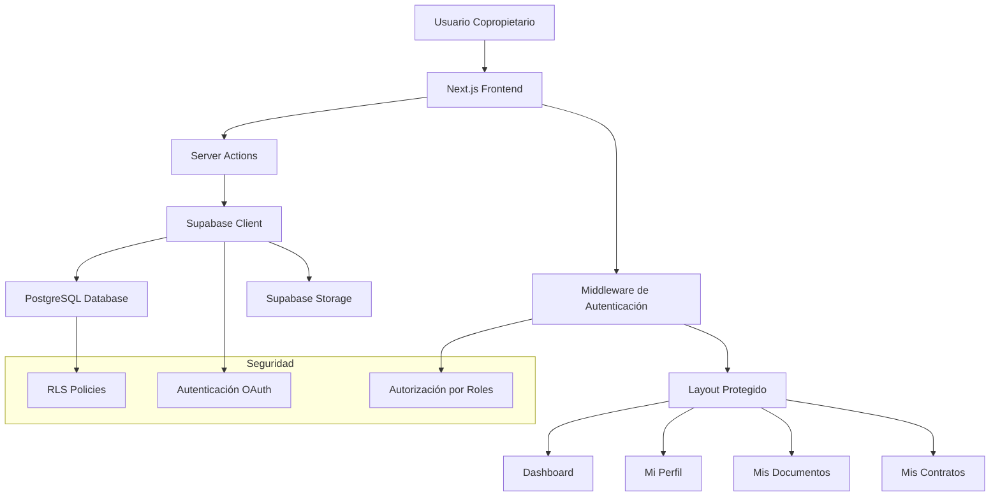
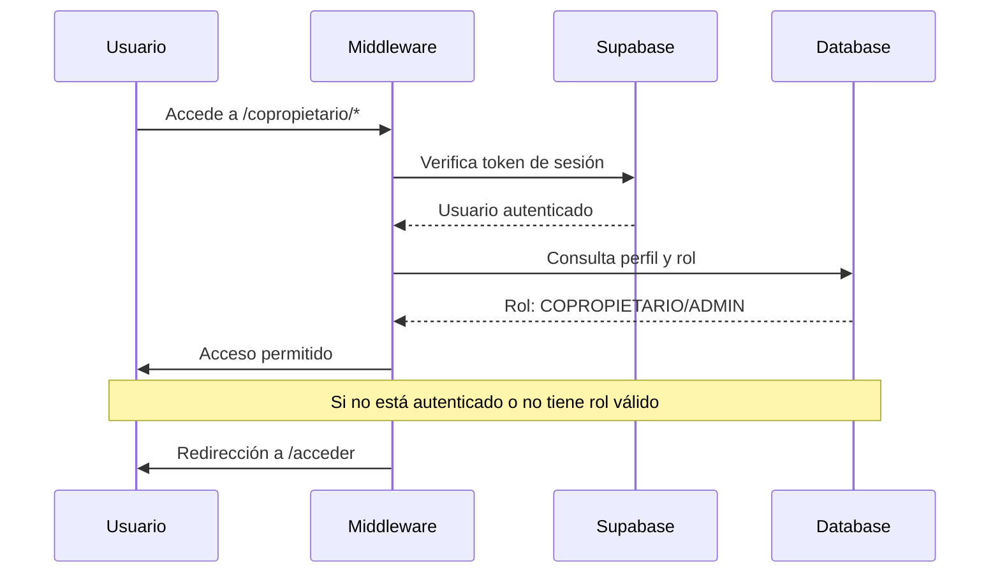

# Portal del Copropietario - MVP Completo

## 1. Resumen del Proyecto

El Portal del Copropietario es una aplicación web completa que permite a los inversionistas gestionar sus fracciones inmobiliarias en el proyecto Tulum Fractional. Proporciona acceso seguro a información de inversión, documentos, contratos y gestión de perfil personal.

**Tecnologías principales:** Next.js 14, React, TypeScript, Supabase, Tailwind CSS

## 2. Arquitectura General

### 2.1 Diagrama de Arquitectura



### 2.2 Flujo de Autenticación y Autorización



## 3. Estructura de Archivos

### 3.1 Rutas del Portal

```
src/app/copropietario/
├── layout.tsx              # Layout protegido con navegación
├── page.tsx               # Redirección automática al dashboard
├── dashboard/
│   └── page.tsx          # Dashboard principal
├── perfil/
│   └── page.tsx          # Página Mi Perfil
├── documentos/
│   └── page.tsx          # Gestión de documentos
└── contratos/
    └── page.tsx          # Tabla de contratos
```

### 3.2 Componentes Especializados

```
src/components/
├── profile/
│   └── ProfileForm.tsx    # Formulario de actualización de perfil
└── documents/
    └── DocumentDownloadButton.tsx  # Botón de descarga segura
```

### 3.3 Server Actions

```
src/app/actions/
├── profile.ts             # Actualización de perfil y fotos
└── documents.ts           # Generación de URLs firmadas
```

## 4. Funcionalidades Implementadas

### 4.1 Dashboard Principal

**Archivo:** `src/app/copropietario/dashboard/page.tsx`

**Características:**
- **Información personalizada:** Saludo con nombre del usuario
- **Resumen de fracciones:** Muestra cantidad de fracciones adquiridas
- **Información del proyecto:** Fecha estimada de entrega dinámica
- **Accesos rápidos:** Enlaces directos a todas las secciones
- **Validación robusta:** Cierre de sesión automático si el perfil no es válido
- **Datos dinámicos:** Obtención del nombre del proyecto desde la base de datos

**Consultas a la base de datos:**
```sql
-- Obtener perfil del usuario
SELECT id, first_name, last_name FROM profiles WHERE user_id = $1

-- Contar fracciones del usuario
SELECT COUNT(*) FROM user_fractions WHERE user_id = $1

-- Obtener detalles del proyecto
SELECT project_name, estimated_delivery FROM propiedad_alfa_details
```

### 4.2 Mi Perfil

**Archivos principales:**
- `src/app/copropietario/perfil/page.tsx`
- `src/components/profile/ProfileForm.tsx`
- `src/app/actions/profile.ts`

**Funcionalidades:**
- **Visualización de datos:** Nombre, apellido, teléfono, email
- **Actualización de información:** Formulario reactivo con validación
- **Gestión de avatar:** Subida y actualización de foto de perfil
- **Integración con Storage:** Almacenamiento seguro en Supabase Storage
- **Estados de UI:** Indicadores de carga, éxito y error
- **Validación de archivos:** Restricciones de tipo y tamaño

**Server Action - updateProfileAction:**
```typescript
export async function updateProfileAction(formData: FormData) {
  // 1. Autenticación del usuario
  // 2. Validación de datos
  // 3. Procesamiento de imagen (si existe)
  // 4. Actualización en base de datos
  // 5. Retorno de resultado
}
```

### 4.3 Mis Documentos

**Archivos principales:**
- `src/app/copropietario/documentos/page.tsx`
- `src/components/documents/DocumentDownloadButton.tsx`
- `src/app/actions/documents.ts`

**Características:**
- **Tabla de documentos:** Lista todos los documentos del usuario
- **Filtrado automático:** Solo muestra documentos del usuario autenticado
- **Descargas seguras:** URLs firmadas temporales (1 hora de validez)
- **Información detallada:** Nombre, tipo, tamaño, fecha de subida
- **Estados de descarga:** Indicadores de progreso y errores
- **Diseño responsive:** Adaptable a diferentes dispositivos

**Server Action - getSecureDocumentUrlAction:**
```typescript
export async function getSecureDocumentUrlAction(storagePath: string) {
  // 1. Verificar autenticación
  // 2. Validar permisos del documento
  // 3. Generar URL firmada temporal
  // 4. Retornar URL segura
}
```

### 4.4 Mis Contratos

**Archivo:** `src/app/copropietario/contratos/page.tsx`

**Funcionalidades:**
- **Tabla de contratos:** Muestra todos los contratos del usuario
- **Información completa:** Fracción, estado, fecha de creación
- **Descarga de contratos:** Integración con sistema de documentos
- **Estados visuales:** Badges diferenciados por estado del contrato
- **Ordenamiento:** Contratos más recientes primero
- **Manejo de casos vacíos:** Mensaje informativo cuando no hay contratos

**Consulta compleja con JOIN:**
```sql
SELECT 
  contracts.id,
  contracts.fraction_id,
  contracts.status,
  contracts.created_at,
  documents.storage_path
FROM contracts
LEFT JOIN documents ON contracts.document_id = documents.id
WHERE contracts.buyer_id = $1
ORDER BY contracts.created_at DESC
```

## 5. Integración con Supabase

### 5.1 Configuración de Base de Datos

**Tablas principales utilizadas:**
- `profiles` - Información de usuarios
- `user_fractions` - Fracciones por usuario
- `documents` - Metadatos de documentos
- `contracts` - Contratos de compra-venta
- `propiedad_alfa_details` - Detalles del proyecto

### 5.2 Row Level Security (RLS)

**Políticas implementadas:**
```sql
-- Profiles: Solo el propio usuario puede ver/editar su perfil
CREATE POLICY "Users can view own profile" ON profiles
FOR SELECT USING (auth.uid() = user_id);

-- Documents: Solo documentos del usuario autenticado
CREATE POLICY "Users can view own documents" ON documents
FOR SELECT USING (user_id = auth.uid());

-- Contracts: Solo contratos donde el usuario es comprador
CREATE POLICY "Users can view own contracts" ON contracts
FOR SELECT USING (buyer_id IN (
  SELECT id FROM profiles WHERE user_id = auth.uid()
));
```

### 5.3 Supabase Storage

**Buckets configurados:**
- `avatars` - Fotos de perfil de usuarios
- `documents` - Documentos y contratos

**Políticas de Storage:**
```sql
-- Avatars: Usuarios pueden subir/actualizar su avatar
CREATE POLICY "Users can upload avatar" ON storage.objects
FOR INSERT WITH CHECK (bucket_id = 'avatars' AND auth.uid()::text = (storage.foldername(name))[1]);

-- Documents: Solo lectura para usuarios autenticados
CREATE POLICY "Users can view own documents" ON storage.objects
FOR SELECT USING (bucket_id = 'documents' AND auth.role() = 'authenticated');
```

## 6. Seguridad y Autenticación

### 6.1 Middleware de Protección

**Archivo:** `src/middleware.ts`

- Verifica autenticación en todas las rutas `/copropietario/*`
- Redirecciona usuarios no autenticados a `/acceder`
- Mantiene la URL de destino para redirección post-login

### 6.2 Layout Protegido

**Archivo:** `src/app/copropietario/layout.tsx`

- **Verificación de roles:** Solo `COPROPIETARIO` o `ADMIN`
- **Navegación contextual:** Menú específico del portal
- **Header sticky:** Navegación siempre visible
- **Redirección automática:** A `/acceso-denegado` si no tiene permisos

### 6.3 Validaciones de Server Actions

```typescript
// Patrón de validación estándar
export async function serverAction(data: FormData) {
  const supabase = await createSupabaseServerClient();
  const { data: { user } } = await supabase.auth.getUser();
  
  if (!user) {
    return { success: false, error: 'No autenticado' };
  }
  
  // Validar permisos específicos
  const { data: profile } = await supabase
    .from('profiles')
    .select('id, role')
    .eq('user_id', user.id)
    .single();
    
  if (!profile || !['COPROPIETARIO', 'ADMIN'].includes(profile.role)) {
    return { success: false, error: 'Sin permisos' };
  }
  
  // Procesar acción...
}
```

## 7. Componentes UI y Diseño

### 7.1 Sistema de Diseño

**Componentes base utilizados:**
- `Card`, `CardHeader`, `CardTitle`, `CardContent`, `CardDescription`
- `Table`, `TableBody`, `TableCell`, `TableHead`, `TableHeader`, `TableRow`
- `Badge` - Para estados y categorías
- `Button` - Acciones principales
- `Input`, `Label` - Formularios
- `Avatar`, `AvatarImage`, `AvatarFallback` - Fotos de perfil

### 7.2 Responsive Design

- **Mobile-first:** Diseño adaptable desde dispositivos móviles
- **Breakpoints:** Utiliza sistema de Tailwind CSS
- **Navegación adaptativa:** Menú colapsable en dispositivos pequeños
- **Tablas responsive:** Scroll horizontal en pantallas pequeñas

### 7.3 Estados de UI

**Patrones implementados:**
- **Loading states:** Spinners y skeletons durante cargas
- **Empty states:** Mensajes informativos cuando no hay datos
- **Error states:** Manejo elegante de errores con mensajes claros
- **Success states:** Confirmaciones de acciones exitosas

## 8. Optimizaciones y Rendimiento

### 8.1 Server Components

- **Renderizado del servidor:** Todas las páginas principales son Server Components
- **Consultas optimizadas:** Datos obtenidos en el servidor antes del renderizado
- **Reducción de JavaScript:** Menos código enviado al cliente

### 8.2 Client Components Estratégicos

- **ProfileForm:** Manejo de estado de formulario y validaciones
- **DocumentDownloadButton:** Interacciones de descarga y estados

### 8.3 Caching y Revalidación

```typescript
// Revalidación automática de datos
export const revalidate = 300; // 5 minutos

// Revalidación manual después de actualizaciones
revalidatePath('/copropietario/perfil');
```

## 9. Manejo de Errores

### 9.1 Estrategias de Error Handling

**Niveles de manejo:**
1. **Validación de entrada:** Verificación de datos antes del procesamiento
2. **Errores de base de datos:** Manejo de fallos de consulta
3. **Errores de autenticación:** Redirecciones y mensajes apropiados
4. **Errores de red:** Reintentos y fallbacks

### 9.2 Logging y Monitoreo

```typescript
// Patrón de logging en Server Actions
try {
  const result = await supabase.from('table').insert(data);
  if (result.error) {
    console.error('Database error:', result.error);
    return { success: false, error: 'Error interno del servidor' };
  }
} catch (error) {
  console.error('Unexpected error:', error);
  return { success: false, error: 'Error inesperado' };
}
```

## 10. Guía de Desarrollo

### 10.1 Comandos de Desarrollo

```bash
# Iniciar servidor de desarrollo
npm run dev

# Verificar tipos TypeScript
npx tsc --noEmit

# Ejecutar linting
npm run lint
```

### 10.2 Estructura de Desarrollo

**Flujo de trabajo recomendado:**
1. **Crear Server Component** para la página principal
2. **Implementar Server Actions** para lógica de negocio
3. **Crear Client Components** solo cuando sea necesario
4. **Configurar RLS policies** en Supabase
5. **Probar autenticación y autorización**
6. **Verificar responsive design**

### 10.3 Mejores Prácticas

**Seguridad:**
- Siempre verificar autenticación en Server Actions
- Usar RLS policies para protección a nivel de base de datos
- Validar permisos antes de operaciones sensibles
- Generar URLs firmadas para descargas de archivos

**Rendimiento:**
- Minimizar Client Components
- Usar Server Components para renderizado inicial
- Implementar caching apropiado
- Optimizar consultas de base de datos

**UX/UI:**
- Proporcionar feedback inmediato en acciones
- Manejar estados de carga elegantemente
- Implementar validación en tiempo real
- Mantener consistencia en el diseño

## 11. Próximos Pasos y Extensiones

### 11.1 Funcionalidades Futuras

- **Notificaciones en tiempo real:** WebSockets para actualizaciones
- **Chat de soporte:** Comunicación directa con administradores
- **Calendario de eventos:** Fechas importantes del proyecto
- **Reportes financieros:** Análisis de inversión detallado
- **Galería de progreso:** Fotos y videos del desarrollo

### 11.2 Optimizaciones Técnicas

- **PWA:** Aplicación web progresiva para móviles
- **Offline support:** Funcionalidad básica sin conexión
- **Push notifications:** Notificaciones del navegador
- **Analytics:** Seguimiento de uso y comportamiento
- **A/B testing:** Optimización de conversión

## 12. Conclusión

El Portal del Copropietario representa un MVP completo y funcional que proporciona todas las herramientas esenciales para la gestión de inversiones inmobiliarias fraccionadas. La arquitectura implementada es escalable, segura y mantiene las mejores prácticas de desarrollo web moderno.

**Características destacadas:**
- ✅ **Autenticación y autorización robusta**
- ✅ **Interfaz de usuario intuitiva y responsive**
- ✅ **Gestión completa de documentos y contratos**
- ✅ **Integración seamless con Supabase**
- ✅ **Seguridad a nivel de base de datos con RLS**
- ✅ **Optimización de rendimiento con Server Components**
- ✅ **Manejo elegante de errores y estados**

El sistema está listo para producción y puede servir como base sólida para futuras expansiones y mejoras del producto.